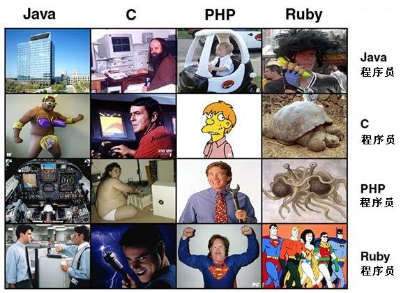
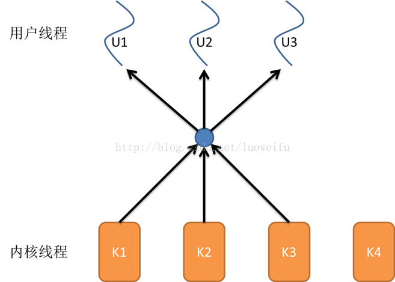
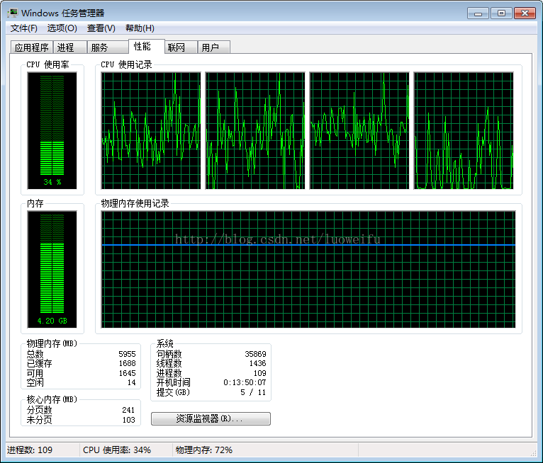
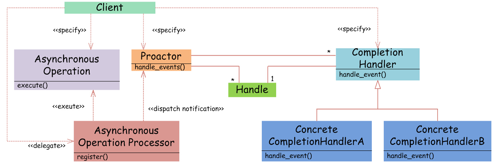

软件研发杂谈

编程语言
========

编程语言选择一览
----------------

你眼中的编程语言是什么

编程语言优缺点图示
------------------

几种主流编程语言的优点和缺点比较
--------------------------------

### Python

一句话概括：需要拿着游标卡尺学习的语言

Python
是一款服务器端解释型开源非编译脚本语言。它常被昵称为胶水语言，能够把用其他语言制作的各种模块（尤其是
C/C++）很轻松地联结在一起。

Python 的优势：Python 学习简单，被誉为 “最易学习的语言”

Python 的不足：Python 存在一些只在特定情况下才会出现（无法重现）的 bug

职业路线：

（1）用 Django 框架进行 Web 开发：和 Java 没什么两样。

（2）用 PIL 框架进行图形处理

（3）物联网：Raspberry Pi 等物联网平台都选择了 Python 作为开发语言

（4）Python 有一个无所不能的 Hack 库，如果认为 “打工时不可能打工的”
就去当一个自由的黑客吧

### C/C++

一句话概括：大多数中国程序员的第一个语言

C 语言是面向过程语言在当代的鲁殿灵光，常用于编写操作系统。C++ 是 C
语言的一个超集，既有指针又有对象使它成为最复杂的语言。

C/C++ 的优势：几乎所有现代编程语言都脱胎于 C/C++，因此了解了
C/C++，就了解了关于编程语言的一切，非常有利于快速掌握其他各类编程语言。

C/C++ 的不足：据说 C/C++
发明的时候为了提高入行门槛和行业收入水平刻意制造了学习难度。

C/C++ 的优势：C/C++ 可以被嵌入任何现代处理器中，几乎所有操作系统都支持
C/C++，跨平台性非常好。

C/C++ 的不足：尽管 C 语言体型小巧，可最常使用的 C++
规模可观且拥有大量极为复杂的功能交互方式，容易造成资源浪费。

职业路线：

（1）首推 Unix/Linux 等操作系统软件的开发和嵌入式开发。

（2）Android ROM 的定制，以及 Android App 的 NDK 开发。

（3）用 Cocos2d-x 开发游戏也是 C++ 程序员的好出路。

### Java

一句话概括：最长寿的语言

Java 是最典型的面向对象语言。Java 不仅吸收了 C++ 语言的各种优点，还摒弃了 C++
里难以理解的多继承、指针等坑爹概念。今明两年毕业的大学生大多是 Java
的同龄人（1995 年）。

Java 的优势：Java 平台不断迎来新功能，比如移动互联网时代的 Android，大数据时代的
Hadoop，人工智能时代的 TensorFlow。

Java 的不足：国内 Java 及其衍生技术的就业环境被培训班破坏得太厉害，培训班 HR
曾问我：“Android 不吃香了，你能推荐几个Hadoop 讲师吗？”

Java 的优势：Java 是世界上使用范围最广的语言——Java 环境安装时那句 “3 Billion
Devices Run Java” 谁没见过？

Java 的不足：Java 占用大量内存，并且启动时间较长——搞 Android 的都被 Windows
系统中的 Android AVD 坑过。

职业路线：

（1）招聘网站上常见的 “招聘 Java 开发” 指的就是狭义的 Java 开发——基于 JavaEE
的后台开发，以前一度流行过 SSH 框架和SSM 框架，现在入门建议学习 SpringMVC 框架。

（2）在移动互联网时代，Java 可用于 Android App 开发。但 Java 之于 Android
的地位可能被 Kotlin 取代，并且近年培训班造成了低水平 Android 程序员的泛滥。

（3）在大数据时代，Java 可用于 Hadoop 的开发，前景非常广阔，但可能有泛滥的趋势。

（4）在人工智能时代，Java 可用于 TensorFlow 深度学习的开发。

### C\#

一句话概括：自称不是 Java 的 Java 语言

C\#是微软看到 Java 太火了而发明的和 Java 语法差不多的语言。

C\#的优势：C\#的最大优势在于全面集成.Net 库，提供出色的功能与完美的库访问能力。

C\#的不足：由于集成.Net 库造成跨平台能力太差。

C\#的优势：VR 时代的到来让 Unity-3d 开发者有很好的发展前景。

C\#的不足：目前.Net 在国内就业环境不太好，收入较低。

职业路线：

（1）招聘网站上常见的 “招聘 C\#开发” 和 “招聘.Net 开发” 指的都是狭义的
C\#开发——基于.Net 框架的后台开发。

（2）Unity-3d 也用 C\#作为开发语言，除了能开发 3D 游戏，在 VR 时代也会大放光芒。

### JavaScript

一句话概括：不是 Java 语言的语言。

JavaScript
是一种动态类型、弱类型、基于原型的直译式脚本语言，也是使用频率最高的给 HTML
网页增加动态功能的语言。外行最常闹的笑话是以为它是 Java 语言的分支。

JavaScript 的优势：作为脚本语言，JavaScript
可立即运行而无需等待服务器响应，速度非常出色。

JavaScript 的不足：代码在用户电脑上运行，可能会被别有用心的坏人恶意利用。

JavaScript 的优势：JavaScript 是动态类型语言，学习难度低。并且掌握了 JavaScript
语言就等于成为能同时开发网页（HTML5）、后台（Node.js）、移动端（React
Native、Weex）的全栈工程师。

JavaScript 的不足：JavaScript 过于依赖浏览器，在不同的浏览器上有不同的表现。

职业路线：

（1）首选 HTML5 的初心：网站和手机站的前端页面开发。

（2）用 Node.js 或 Bmob 云端代码进行后台开发

（3）基于 React Native、PhoneGap、Weex、HBuilder、AppCan
进行移动开发，只需写一遍代码，就有 Android 和 iOS 两个软件

（4）微信开发：包括微信公众号、微信小游戏、微信小程序。不要把这个方向当成中国特色方向，国外的
Android 机也是需要 PWA开发的。

（5）如果以上四样全能做到，那么你就是全栈工程师。

### SQL

一句话概括：数据库离不开的语言

SQL
是一种专精于数据库的特殊目的语言。用于存取数据以及查询、更新和管理关系数据库系统。

SQL 的优势：存储过程可以重复使用, 可减少数据库开发人员的工作量，开发速度快。

SQL 的不足：和 Java 语言的大多数设计模式一样，SQL
开发速度是靠牺牲运行速度换来的。

SQL 的优势：SQL 可设定只有某此用户才具有对指定存储过程的使用权，安全性好。

SQL 的不足：不同数据库系统之间的 SQL 不能完全相互通用，可移植性差。

职业路线：

（1）掌握了 SQL 可以从事 DBA（Database
Administrator，即数据库管理员），主要负责业务数据库从设计、测试到部署交付的全生命周期管理。

### PHP

一句话概括：世界上最好的语言

PHP 是一种通用开源脚本语言。语法吸收了 C 语言、Java 和 Perl
的特点，利于学习，使用广泛，主要适用于 Web 开发领域。号称 “世界上最好的语言”

PHP 的优势：PHP 学习简单，易于快速上手。

PHP 的不足：PHP 的运行速度比较慢。

PHP 的优势：历久弥新的 PHP
拥有庞大而活跃的官方社区，开发者面临的大部分难题都有现成的解决方案，很多十几年前的解决方案在当代也有指导意义。

PHP 的不足：PHP 的错误处理机制比较糟糕，以为 PHP 需要支持大量旧版本的功能。

职业路线：

（1）适合进行 Web 开发，配合 Node.js 效果更佳。

C++11/14/17/20
==============

参考标准
--------

http://zh.cppreference.com/w/cpp

| **年份** | **C++ 标准**         | **正式名称** |
|----------|----------------------|--------------|
| 1998     | ISO/IEC 14882:1998   | C++98        |
| 2003     | ISO/IEC 14882:2003   | C++03        |
| 2011     | ISO/IEC 14882:2011   | C++11        |
| 2014     | ISO/IEC 14882:2014   | C++14        |
| 2017     | Yet to be determined | C++17        |
| 2020     | Yet to be determined | C++20        |

新特征一窥
----------

### string

cout \<\< R"(c:\\windows\\1.txt)" \<\< endl;

### Auto

以前这么写

int i=5;

int\* arr = new int(10);

Vector\<int\> vec;

vector\<int\>::const_iterator it = vec.cbegin();

现在这么写

auto it = vec.begin();

auto i = 5; // i 被推导为 int  
auto arr = new auto(10); // arr 被推导为 int \*

### for

以前这么写

int a[10];

for (int a = 0; a\<10; a++) {}

现在这么写

for (int i : a) { }

### 智能指针

| [unique_ptr](http://zh.cppreference.com/w/cpp/memory/unique_ptr) (C++11)    | 拥有独有对象所有权语义的智能指针                                                                     |
|                                                                             | (类模板)                                                                                             |
|-----------------------------------------------------------------------------|------------------------------------------------------------------------------------------------------|
| [shared_ptr](http://zh.cppreference.com/w/cpp/memory/shared_ptr) (C++11)    | 拥有共享对象所有权语义的智能指针                                                                     |
|                                                                             | (类模板)                                                                                             |
| [weak_ptr](http://zh.cppreference.com/w/cpp/memory/weak_ptr) (C++11)        | 由[std::shared_ptr](http://zh.cppreference.com/w/cpp/memory/shared_ptr)所管理的对象的弱引用          |
|                                                                             | (类模板)                                                                                             |
| [auto_ptr](http://zh.cppreference.com/w/cpp/memory/auto_ptr) (C++17 中移除) | 拥有严格对象所有权语义的智能指针                                                                     |
|                                                                             | (类模板)                                                                                             |

实例

template\<class T\>

class ClassA

{

public:

ClassA() = default;

ClassA(T& t) :m_value(t) { std::cout \<\< "Test::Test" \<\< std::endl; }

\~ClassA() { std::cout \<\< "Test::\~Test destructor" \<\< std::endl; }

T m_value;

};

void AutoPtrTest() {

auto ma = make_auto\<ClassA\<int\> \>(5);

auto ms = make_shared\<ClassA\<std::string\> \>("hello");

auto ms1 = ms;

auto ms2 = ms;

auto mu = make_unique\<ClassA\<int\> \>(6);

}

输出

Test::Test 5

Test::Test hello

Test::Test 6

Test::\~Test destructor

Test::\~Test destructor

Test::\~Test destructor

### lambda

**[** *captures* **]** *\<tparams\>*(可选)(C++20) **(** *params* **)** *specifiers*(可选) *exception* *attr* **-\>** *ret* *requires*(可选)(C++20) **{** *body* **}**

template\<typename T\>

T calc(T a, T b, function\<T(T, T)\> f)

{

return f(a, b);

}

void test_lambda()

{

auto a = calc\<int\>(2, 3,  { return a + b; }); // 5

auto b = calc\<string\>("hello", "world",

 { string c = a + b; return c; } // helloworld

);

}

### 正则表达式

-   C++11种提供了regex模块。

-   regex默认采用ECMA-262标准，和浏览器中使用的一样。

-   regex提供了查找、匹配、迭代器、子表达式、替换等常用用法。

### 线程

void test_thread()

{

std::thread t1( {

this_thread::sleep_for(chrono::seconds(1));

cout \<\< "thread id is " \<\< this_thread::get_id() \<\< endl; }

);

std::thread t2(

 {

cout \<\< "thread id is " \<\< "param0 is " \<\< a \<\< "param1 is " \<\< endl;

},

5,

"hello"

);

t1.join();

t2.join();

}

### 并发

#### 互斥

void test_mutex()

{

mutex mt;

int ti = 0;

thread t1([&]() {

for (auto i = 0; i \< 500; i++)

{

//lock_guard\<mutex\> ul(mt);

unique_lock\<mutex\> ul(mt);

ti+=10;

}

}

);

thread t2(

[&]()

{

for (auto i = 0; i \< 500; i++)

{

mt.lock();

ti++;

mt.unlock();

}

}

);

t1.join();

t2.join();

cout \<\< "ti=" \<\< ti \<\< endl;

}

#### 条件变量

void test_condition_var()

{

std::condition_variable cv;

mutex mt;

int ti = 0;

thread t1([&]() {

this_thread::sleep_for(chrono::seconds(2));

cv.notify_one();

this_thread::sleep_for(chrono::seconds(1));

cv.notify_all();

}

);

thread t2(

[&]()

{

unique_lock\<mutex\> ul(mt);

cv.wait(ul);

ti += 10;

cout \<\< this_thread::get_id() \<\< " " \<\< ti \<\< endl;

}

);

thread t3(

[&]()

{

unique_lock\<mutex\> ul(mt);

cv.wait(ul);

ti += 10;

cout \<\< this_thread::get_id() \<\< " " \<\< ti \<\< endl;

}

);

thread t4(

[&]()

{

unique_lock\<mutex\> ul(mt);

cv.wait(ul);

ti += 10;

cout \<\< this_thread::get_id() \<\< " " \<\< ti \<\< endl;

}

);

t1.join();

t2.join();

t3.join();

t4.join();

cout \<\< "ti=" \<\< ti \<\< endl;

}

不足
----

-   标准委员会动作太慢，语言进化太慢！

-   标准库不足，C++98不支持线程、网络、正则、xml处理等

-   开源项目较之其他语言少

-   语法太复杂，门槛高，比如：函数重载，操作符重载，模板，可变参数模板，虚函数，纯虚函数，多继承，多种继承方式，C++最大的缺点就是它让你把大量精力花在学习语言上，而不是解决问题上。

-   不支持垃圾回收，Java程序员是孩子，嚷嚷要这个那个，玩完了就丢，JVM是家长，买买买，还要负责收拾。有的孩子熊点，屋子很乱，收拾起来费劲，但房子还在。C++程序员是神，操纵着江河湖海，日月星辰，但能力越大，责任越大，万一新来的神比较愣，手一滑，宇宙就退出了。新手写C++，像是抱着一捆指针，在浩瀚的内存中裸奔。跑着跑着，有的指针掉了，不知踪影，内存就泄露了；跑着跑着，突然被人逮住，按在地上打的error纷飞，内存就越界了；终于到了，舒了口气，把指针插在脚下，念出咒语，“delete”系统就崩溃了！

-   网络功能，XML，json解析等不支持

-   不支持反射机制

操作系统
--------

程序开发语言综述
----------------

### C语言

### C++

### J2SE

### J2EE

### Java Web

### .NET

### Javascript

### Python

### GO

安全工程师
----------

前端开发
--------

大数据
------

Hadoop家族
----------

架构师
------

CTO
---

开发模式
========

基本概念
--------

### 线程

什么是线程？线程与进程与有什么关系？这是一个非常抽象的问题，也是一个特别广的话题，涉及到非常多的知识。我不能确保能把它讲的话，也不能确保讲的内容全部都正确。即使这样，我也希望尽可能地把他讲通俗一点，讲的明白一点，因为这是个一直困扰我很久的，扑朔迷离的知识领域，希望通过我的理解揭开它一层一层神秘的面纱。

 

### 任务调度

线程是什么？要理解这个概念，须要先了解一下操作系统的一些相关概念。大部分操作系统(如Windows、Linux)的任务调度是采用时间片轮转的抢占式调度方式，也就是说一个任务执行一小段时间后强制暂停去执行下一个任务，每个任务轮流执行。任务执行的一小段时间叫做时间片，任务正在执行时的状态叫运行状态，任务执行一段时间后强制暂停去执行下一个任务，被暂停的任务就处于就绪状态等待下一个属于它的时间片的到来。这样每个任务都能得到执行，由于CPU的执行效率非常高，时间片非常短，在各个任务之间快速地切换，给人的感觉就是多个任务在“同时进行”，这也就是我们所说的并发(别觉得并发有多高深，它的实现很复杂，但它的概念很简单，就是一句话：多个任务同时执行)。多任务运行过程的示意图如下：

 

### 进程

我们都知道计算机的核心是CPU，它承担了所有的计算任务；而操作系统是计算机的管理者，它负责任务的调度、资源的分配和管理，统领整个计算机硬件；应用程序侧是具有某种功能的程序，程序是运行于操作系统之上的。

进程是一个具有一定独立功能的程序在一个数据集上的一次动态执行的过程，是操作系统进行资源分配和调度的一个独立单位，是应用程序运行的载体。进程是一种抽象的概念，从来没有统一的标准定义。进程一般由程序、数据集合和进程控制块三部分组成。程序用于描述进程要完成的功能，是控制进程执行的指令集；数据集合是程序在执行时所需要的数据和工作区；程序控制块(Program Control Block，简称PCB)，包含进程的描述信息和控制信息，是进程存在的唯一标志。

进程具有的特征：

动态性：进程是程序的一次执行过程，是临时的，有生命期的，是动态产生，动态消亡的；

并发性：任何进程都可以同其他进程一起并发执行；

独立性：进程是系统进行资源分配和调度的一个独立单位；

结构性：进程由程序、数据和进程控制块三部分组成。

 

### 线程

在早期的操作系统中并没有线程的概念，进程是能拥有资源和独立运行的最小单位，也是程序执行的最小单位。任务调度采用的是时间片轮转的抢占式调度方式，而进程是任务调度的最小单位，每个进程有各自独立的一块内存，使得各个进程之间内存地址相互隔离。

后来，随着计算机的发展，对CPU的要求越来越高，进程之间的切换开销较大，已经无法满足越来越复杂的程序的要求了。于是就发明了线程，线程是程序执行中一个单一的顺序控制流程，是程序执行流的最小单元，是处理器调度和分派的基本单位。一个进程可以有一个或多个线程，各个线程之间共享程序的内存空间(也就是所在进程的内存空间)。一个标准的线程由线程ID、当前指令指针(PC)、寄存器和堆栈组成。而进程由内存空间(代码、数据、进程空间、打开的文件)和一个或多个线程组成。

### 协程

协程是啥 ——一句话说明什么是线程：**协程是一种用户态的轻量级线程**。  
首先我们得知道协程是啥？协程其实可以认为是比线程更小的执行单元。为啥说他是一个执行单元，因为他自带CPU上下文。这样只要在合适的时机，我们可以把一个协程
切换到 另一个协程。只要这个过程中保存或恢复 CPU上下文那么程序还是可以运行的。

协程和线程差异   
那么这个过程看起来比线程差不多哇。其实不然 线程切换从系统层面远不止 保存和恢复
CPU上下文这么简单。操作系统为了程序运行的高效性每个线程都有自己缓存Cache等等数据，操作系统还会帮你做这些数据的恢复操作。所以线程的切换非常耗性能。但是协程的切换只是单纯的操作CPU的上下文，所以一秒钟切换个上百万次系统都抗的住。

协程的问题   
但是协程有一个问题，就是系统并不感知，所以操作系统不会帮你做切换。那么谁来帮你做切换？让需要执行的协程更多的获得CPU时间才是问题的关键。

### 进程与线程的区别

前面讲了进程与线程，但可能你还觉得迷糊，感觉他们很类似。的确，进程与线程有着千丝万缕的关系，下面就让我们一起来理一理：

1.线程是程序执行的最小单位，而进程是操作系统分配资源的最小单位；

2.一个进程由一个或多个线程组成，线程是一个进程中代码的不同执行路线；

3.进程之间相互独立，但同一进程下的各个线程之间共享程序的内存空间(包括代码段、数据集、堆等)及一些进程级的资源(如打开文件和信号)，某进程内的线程在其它进程不可见；

4.调度和切换：线程上下文切换比进程上下文切换要快得多。 

线程与进程关系的示意图：

图 2：进程与线程的资源共享关系

 

图 3：单线程与多线程的关系

 

总之，线程和进程都是一种抽象的概念，线程是一种比进程更小的抽象，线程和进程都可用于实现并发。

 

在早期的操作系统中并没有线程的概念，进程是能拥有资源和独立运行的最小单位，也是程序执行的最小单位。它相当于一个进程里只有一个线程，进程本身就是线程。所以线程有时被称为轻量级进程(Lightweight Process，LWP）。

图 4：早期的操作系统只有进程，没有线程

后来，随着计算机的发展，对多个任务之间上下文切换的效率要求越来越高，就抽象出一个更小的概念——线程，一般一个进程会有多个(也可是一个)线程。

图 5：线程的出现，使得一个进程可以有多个线程

 

### 多线程与多核

上面提到的时间片轮转的调度方式说一个任务执行一小段时间后强制暂停去执行下一个任务，每个任务轮流执行。很多操作系统的书都说“同一时间点只有一个任务在执行”。那有人可能就要问双核处理器呢？难道两个核不是同时运行吗？

其实“同一时间点只有一个任务在执行”这句话是不准确的，至少它是不全面的。那多核处理器的情况下，线程是怎样执行呢？这就需要了解内核线程。

多核(心)处理器是指在一个处理器上集成多个运算核心从而提高计算能力，也就是有多个真正并行计算的处理核心，每一个处理核心对应一个内核线程。内核线程（Kernel Thread， KLT）就是直接由操作系统内核支持的线程，这种线程由内核来完成线程切换，内核通过操作调度器对线程进行调度，并负责将线程的任务映射到各个处理器上。一般一个处理核心对应一个内核线程，比如单核处理器对应一个内核线程，双核处理器对应两个内核线程，四核处理器对应四个内核线程。

现在的电脑一般是双核四线程、四核八线程，是采用超线程技术将一个物理处理核心模拟成两个逻辑处理核心，对应两个内核线程，所以在操作系统中看到的CPU数量是实际物理CPU数量的两倍，如你的电脑是双核四线程，打开“任务管理器\\性能”可以看到4个CPU的监视器，四核八线程可以看到8个CPU的监视器。

 

图 6：双核四线程在Windows8下查看的结果

超线程技术就是利用特殊的硬件指令，把一个物理芯片模拟成两个逻辑处理核心，让单个处理器都能使用线程级并行计算，进而兼容多线程操作系统和软件，减少了CPU的闲置时间，提高的CPU的运行效率。这种超线程技术(如双核四线程)由处理器硬件的决定，同时也需要操作系统的支持才能在计算机中表现出来。

 

程序一般不会直接去使用内核线程，而是去使用内核线程的一种高级接口——轻量级进程（Light Weight Process，LWP），轻量级进程就是我们通常意义上所讲的线程(我们在这称它为用户线程)，由于每个轻量级进程都由一个内核线程支持，因此只有先支持内核线程，才能有轻量级进程。用户线程与内核线程的对应关系有三种模型：一对一模型、多对一模型、多对多模型，在这以4个内核线程、3个用户线程为例对三种模型进行说明。

#### 一对一模型

对于一对一模型来说，一个用户线程就唯一地对应一个内核线程(反过来不一定成立，一个内核线程不一定有对应的用户线程)。这样，如果CPU没有采用超线程技术(如四核四线程的计算机)，一个用户线程就唯一地映射到一个物理CPU的线程，线程之间的并发是真正的并发。一对一模型使用户线程具有与内核线程一样的优点，一个线程因某种原因阻塞时其他线程的执行不受影响；此处，一对一模型也可以让多线程程序在多处理器的系统上有更好的表现。

但一对一模型也有两个缺点：1.许多操作系统限制了内核线程的数量，因此一对一模型会使用户线程的数量受到限制；2.许多操作系统内核线程调度时，上下文切换的开销较大，导致用户线程的执行效率下降。

 

 

图 7：一对一模型

 

 

#### 多对一模型

多对一模型将多个用户线程映射到一个内核线程上，线程之间的切换由用户态的代码来进行，因此相对一对一模型，多对一模型的线程切换速度要快许多；此外，多对一模型对用户线程的数量几乎无限制。但多对一模型也有两个缺点：1.如果其中一个用户线程阻塞，那么其它所有线程都将无法执行，因为此时内核线程也随之阻塞了；2.在多处理器系统上，处理器数量的增加对多对一模型的线程性能不会有明显的增加，因为所有的用户线程都映射到一个处理器上了。

 

图 8：多对一模型

 

#### 多对多模型

多对多模型结合了一对一模型和多对一模型的优点，将多个用户线程映射到多个内核线程上。多对多模型的优点有：1.一个用户线程的阻塞不会导致所有线程的阻塞，因为此时还有别的内核线程被调度来执行；2.多对多模型对用户线程的数量没有限制；3.在多处理器的操作系统中，多对多模型的线程也能得到一定的性能提升，但提升的幅度不如一对一模型的高。

在现在流行的操作系统中，大都采用多对多的模型。

 

图 9：多对多模型

 

 

### 查看进程与线程

一个应用程序可能是多线程的，也可能是多进程的，如何查看呢？在Windows下我们只须打开任务管理器就能查看一个应用程序的进程和线程数。按“Ctrl+Alt+Del”或右键快捷工具栏打开任务管理器。

查看进程数和线程数：

 

图 10：查看线程数和进程数

在“进程”选项卡下，我们可以看到一个应用程序包含的线程数。如果一个应用程序有多个进程，我们能看到每一个进程，如在上图中，Google的chrome浏览器就有多个进程。同时，如果打开了一个应用程序的多个实例也会有多个进程，如上图中我打开了两个cmd窗口，就有两个cmd进程。如果看不到线程数这一列，可以在点击“查看\\选择列”菜单，增加监听的列。

 

查看CPU和内存的使用率：

在性能选项卡中，我们可以查看CPU和内存的使用率，根据CPU使用记录的监视器的个数还能看出逻辑处理核心的个数，如我的双核四线程的计算机就有四个监视器。

 

### 线程的生命周期

当线程的数量小于处理器的数量时，线程的并发是真正的并发，不同的线程运行在不同的处理器上。但当线程的数量大于处理器的数量时，线程的并发会受到一些阻碍，此时并不是真正的并发，因为此时至少有一个处理器会运行多个线程。

在单个处理器运行多个线程时，并发是一种模拟出来的状态。操作系统采用时间片轮转的方式轮流执行每一个线程。现在，几乎所有的现代操作系统采用的都是时间片轮转的抢占式调度方式，如我们熟悉的Unix、Linux、Windows及Mac OS X等流行的操作系统。

我们知道线程是程序执行的最小单位，也是任务执行的最小单位。在早期只有进程的操作系统中，进程有五种状态，创建、就绪、运行、阻塞(等待)、退出。早期的进程相当于现在的只有单个线程的进程，那么现在的多线程也有五种状态，现在的多线程的生命周期与早期进程的生命周期类似。

 

图 12：早期进程的生命周期

进程在运行过程有三种状态：就绪、运行、阻塞，创建和退出状态描述的是进程的创建过程和退出过程。

创建：进程正在创建，还不能运行。操作系统在创建进程时要进行的工作包括分配和建立进程控制块表项、建立资源表格并分配资源、加载程序并建立地址空间；

就绪：时间片已用完，此线程被强制暂停，等待下一个属于他的时间片到来；

运行：此线程正在执行，正在占用时间片；

阻塞：也叫等待状态，等待某一事件(如IO或另一个线程)执行完；

退出：进程已结束，所以也称结束状态，释放操作系统分配的资源。

 

图 13：线程的生命周期

 

创建：一个新的线程被创建，等待该线程被调用执行；

就绪：时间片已用完，此线程被强制暂停，等待下一个属于他的时间片到来；

运行：此线程正在执行，正在占用时间片；

阻塞：也叫等待状态，等待某一事件(如IO或另一个线程)执行完；

退出：一个线程完成任务或者其他终止条件发生，该线程终止进入退出状态，退出状态释放该线程所分配的资源。

### 小结

从硬件发展来看，从最初的单核单CPU，到单核多CPU，多核多CPU，似乎已经到了极限了，但是单核CPU性能却还在不断提升。server端也在不断的发展变化。如果将程序分为IO密集型应用和CPU密集型应用，二者的server的发展如下：  
IO密集型应用: 多进程-\>多线程-\>事件驱动-\>协程  
CPU密集型应用:多进程--\>多线程

编程模式演化
------------

早期单机时代，一台电脑上运行多个进程，大家各干各的，老死不相往来。假如A进程需要一个画图的功能，B进程也需要一个画图的功能，程序员就必须为两个进程都写一个画图的功能。这不是整人么？于是就出现了IPC（Inter-process
communication，单机中运行的进程之间的相互通信）。OK，现在A既然有了画图的功能，B就调用A进程上的画图功能好了，终于可以偷下懒了。

到了网络时代，大家的电脑都连起来了。以前程序只能调用自己电脑上的进程，能不能调用其他机器上的进程呢？于是就程序员就把IPC扩展到网络上，这就是RPC（远程过程调用）了。现在不仅单机上的进程可以相互通信，多机器中的进程也可以相互通信了。

要知道实现RPC很麻烦呀，什么多线程、什么Socket、什么I/O，都是让咱们普通程序员很头疼的事情。于是就有牛人开发出RPC框架（比如，CORBA、RMI、Web
Services、Thrift、 Web Services等，甚至Restful）。

单进程多进程多线程协程

单机网络分布式大数据

ExedllcomRPC网络协作

机器语言汇编面向过程面向对象函数式编程

单机集群分布式

### 单进程单线程

传统模式，一个进程搞定一切，不需要协作的程序，功能简单的程序可以使用这种模式，无法充分利用CPU资源。

### 多进程

优点：内存隔离，单个进程的崩溃不会导致这个系统的崩溃。而且进程方便测试以及编程简单。

缺点：创建销毁比较麻烦，进程间数据的共享麻烦，需要用到IPC，并且消耗的资源比较多。

### 多线程

优点：可以提高系统的并行性，数据共享比较方便，切换比较快。

缺点：由于没有内存的隔离，所以导致了一个线程的崩溃会导致整个进程的崩溃。编程复杂以及调试困难，线程执行的随机性可能导致逻辑混乱，甚至发生死锁现象；

### 多进程VS多线程

| **对比维度**   | **多进程**                                                       | **多线程**                                                     | **总结** |
|----------------|------------------------------------------------------------------|----------------------------------------------------------------|----------|
| 数据共享、同步 | 数据共享复杂，需要用IPC；数据是分开的，同步简单                  | 因为共享进程数据，数据共享简单，但也是因为这个原因导致同步复杂 | 各有优势 |
| 内存、CPU      | 占用内存多，切换复杂，CPU利用率低                                | 占用内存少，切换简单，CPU利用率高                              | 线程占优 |
| 创建销毁、切换 | 创建销毁、切换复杂，速度慢                                       | 创建销毁、切换简单，速度很快                                   | 线程占优 |
| 编程、调试     | 编程简单，调试简单                                               | 编程复杂，调试复杂                                             | 进程占优 |
| 可靠性         | 进程间不会互相影响                                               | 一个线程挂掉将导致整个进程挂掉                                 | 进程占优 |
| 分布式         | 适应于多核、多机分布式；如果一台机器不够，扩展到多台机器比较简单 | 适应于多核分布式                                               | 进程占优 |

### 线程同步、进程同步

Linux进程间通信：管道、信号、消息队列、共享内存、信号量、套接字(socket)

Linux线程间通信：互斥量（mutex），信号量，条件变量

Windows进程间通信：管道、消息队列、共享内存、信号量 （semaphore）
、套接字(socket) 、RPC

Windows线程间通信：互斥量（mutex），信号量（semaphore）、临界区（critical
section）、事件（event）

### 网络

#### TCP/IP

#### SOCKET

#### RPC

##### 什么是RPC

RPC(Remote Produce
Call)指的是进程间通信。就是允许程序调用另一个地址空间（通常是共享网络的另一台机器上）的过程或函数，且不需要显式编码这个远程调用的细节。

##### 为什么需要RPC

因为如今大公司内部系统由大大小小的许多服务组成，服务部署在不同的机器上，如果服务间的调用都是走网络通信，未免也太过复杂，服务消费方没调用一个服务都要写一部分网络通信的代码，太过繁琐且容易出错。如果能像本地调用一个去调用远程连接这样该多好啊，这种方式就是RPC远程调用。

##### RPC原理

#### HTTP/HTTPS

##### 为什么使用HTTP

C/S模式的缺点

1、适用面窄，通常用于局域网中。

2、用户群固定。由于程序需要安装才可使用，因此不适合面向一些不可知的用户。

3、维护成本高，发生一次升级，则所有客户端的程序都需要改变。

相对于C/S，B/S具有如下优势：

1、分布性：面向浏览器，操作系统都有浏览器，不需要额外安装客户端，可以随时进行查询、浏览等业务

2、业务扩展方便：增加网页即可增加服务器功能

3、维护简单方便：改变网页，即可实现所有用户同步更新

4、开发简单，共享性强，成本低，数据可以持久存储在云端而不必担心数据的丢失。

#### REST

##### REST是什么

REST是一种架构风格，其核心是面向资源，REST专门针对网络应用设计和开发方式，以降低开发的复杂性，提高系统的可伸缩性。REST提出设计概念和准则为：

1. 网络上的所有事物都可以被抽象为资源(resource)

2. 每一个资源都有唯一的资源标识(resource
identifier)，对资源的操作不会改变这些标识

3. 所有的操作都是无状态的

REST简化开发，其架构遵循CRUD原则，该原则告诉我们对于资源(包括网络资源)只需要四种行为：创建，获取，更新和删除就可以完成相关的操作和处理。您可以通过统一资源标识符（Universal
Resource Identifier，URI）来识别和定位资源，并且针对这些资源而执行的操作是通过
HTTP 规范定义的。其核心操作只有GET,PUT,POST,DELETE。

由于REST强制所有的操作都必须是stateless的，这就没有上下文的约束，如果做分布式，集群都不需要考虑上下文和会话保持的问题。极大的提高系统的可伸缩性。

对于SOAP Webservice和Restful
Webservice的选择问题，首先需要理解就是SOAP偏向于面向活动，有严格的规范和标准，包括安全，事务等各个方面的内容，同时SOAP强调操作方法和操作对象的分离，有WSDL文件规范和XSD文件分别对其定义。而REST强调面向资源，只要我们要操作的对象可以抽象为资源即可以使用REST架构风格。

##### 为什么使用REST

RPC（Remote Procedure Call
Protocol），即远程过程调用，是一种进程之间通信的技术。在一开始，电脑的各个进程之间是无法通讯的。为了让进程之间能够互相通讯，于是就发明了IPC（Inter-process
communication，单机中运行的进程之间的相互通信）技术。随着互联网的出现，人们又将IPC扩展成为了RPC，于是实现了不同机器之间进程的通讯。

但是，实现RPC是很麻烦的。为了让RPC变得简单，程序员发明了各种各样的框架。Restful就是其中一类高效以及简洁易用的架构风格。

#### 四种常用IO模型

1) 同步阻塞IO（Blocking IO）

2) 同步非阻塞IO（Non-blocking IO）

3) IO多路复用（IO Multiplexing）

4) 异步IO（Asynchronous IO）

注意以下概念:

1.同步/异步

同步和异步是相对的

同步 前后两件任务, 有严格的顺序一致性(依赖和递进), 按顺序执行,
执行完一个再执行下一个, 需要等待、协调运行

异步 对顺序的要求和依赖关系没那么强, 表现出来就是两个任务可以分给两个人做,
在等待任务A结束时(同步点前)可以进行任务B

多线程就是实现异步的一个方式, 它把"第二件任务"交给其他的线程去做了.
硬件的DMA也是异步.

在实际编程中, 同步和异步区分了请求与响应的交互中, 获取响应的方式

同步: 请求某种结果, 响应返回所需结果

异步: 请求'给我结果', 第一次响应回答'我知道了', 第二次响应通知请求线程'已完成'
(通过状态通知或调用请求者注册的回调函数等方式)

2.阻塞/非阻塞

阻塞和非阻塞也是相对概念

阻塞 : 请求-响应比较耗时, 如IO操作

非阻塞: 请求-响应比较迅速, 如没有等待IO完成就直接返回状态值

socket的非阻塞IO需要设置为NONBLOCK

##### 1.同步阻塞IO

最简单的IO模型，用户线程在读写时被阻塞

数据拷贝指请求到的数据先存放在内核空间, 然后从内核空间拷贝至程序的缓冲区

伪代码如下

{  
// read阻塞

read(socket, buffer);

// 处理buffer

process(buffer);

}

用户线程在IO过程中被阻塞，不能做任何事情，对CPU的资源利用率不高

 

##### 2. 同步非阻塞

用户线程不断发起IO请求. 数据未到达时系统返回一状态值; 数据到达后才真正读取数据

伪代码如下

{

// read非阻塞

while(read(socket, buffer) != SUCCESS);

process(buffer);

}

用户线程每次请求IO都可以立即返回，但是为了拿到数据，需不断轮询，无谓地消耗了大量的CPU  
一般很少直接使用这种模型，而是在其他IO模型中使用非阻塞IO这一特性

##### 3. IO多路复用

IO多路复用建立在内核提供的阻塞函数select上

用户先将需要进行IO操作的socket添加到select中，然后等待阻塞函数select返回。当数据到达后，socket被激活，select返回，用户线程就能接着发起read请求

伪代码如下:

{

// 注册

select(socket);

// 轮询

while(true) {

// 阻塞

sockets = select();

// 数据到达, 解除阻塞

for(socket in sockets) {

if(can_read(socket)) {

// 数据已到达, 那么socket阻不阻塞无所谓  
　　　　　　　read(socket, buffer);

process(buffer);

}

}

}

}

看起来和加了循环的同步阻塞IO差不多?

实际上, 我们可以给select注册多个socket,
然后不断调用select读取被激活的socket，实现在同一线程内同时处理多个IO请求的效果.

至此, 同步阻塞(阻塞在select) / 同步非阻塞(IO没有阻塞) {不知道该怎么称呼}完成

更进一步, 我们把select轮询抽出来放在一个线程里,
用户线程向其注册相关socket或IO请求，等到数据到达时通知用户线程，则可以提高用户线程的CPU利用率.

这样, 便实现了异步方式

这其实是Reactor设计模式, 如下图

EventHandler抽象类表示IO事件处理器  
   get_handle方法获得文件句柄Handle  
   handle_event方法实现对Handle的操作  
可继承EventHandler对事件处理器的行为进行定制

Reactor类管理EventHandler的注册、删除. handle_events方法实现了事件循环,
其不断调用阻塞函数select,
只要某个文件句柄被激活（可读/写等），select就从阻塞中返回,
handle_events接着调用与文件句柄关联的事件处理器的handle_event进行相关操作。handler_events的伪代码如下

Reactor::handle_events() {

while(true) {

sockets = select();

for(socket in sockets) {

get_event_handler(socket).handle_event();

}

}

}

作为功能调用者需要实现的伪代码如下

// 继承EventHandler并重写handle_event()方法

void UserEventHandler::handle_event() {

if(can_read(socket)) {

// 数据已到达, 那么socket阻不阻塞无所谓

read(socket, buffer);

process(buffer);

}

}

// 注册实现的EventHandler子类

{

Reactor.register(new UserEventHandler(socket));

}

IO多路复用是最常使用的IO模型，因其轮询select的线程会被阻塞,
异步程度还不够“彻底”, 所以常被称为异步阻塞IO

 

##### 4. 异步IO

真正的异步IO需要操作系统更强的支持。  
IO多路复用模型中，数据到达内核后通知用户线程，用户线程负责从内核空间拷贝数据;  
而在异步IO模型中，当用户线程收到通知时，数据已经被操作系统从内核拷贝到用户指定的缓冲区内，用户线程直接使用即可。

异步IO模型使用了Proactor设计模式实现了这一机制。

Reactor模式中，用户线程向Reactor对象注册事件对应的事件处理器，然后事件触发时Reactor调用事件处理函数。  
Proactor模式中，用户线程将AsynchronousOperation（读/写等）、Proactor以及操作完成时的CompletionHandler注册到AsynchronousOperationProcessor。  
AsynchronousOperationProcessor使用Facade模式提供了一组异步API（读/写等）供用户调用.
当用户线程调用异步API后，便继续执行下一步代码.
而此时AsynchronousOperationProcessor会开启独立的内核线程执行异步操作。  
当read请求的数据到达时，由内核负责读取socket中的数据，并写入用户指定的缓冲区中。  
异步IO完成时，AsynchronousOperationProcessor将Proactor和CompletionHandler取出，并将IO操作结果和CompletionHandler分发给Proactor，Proactor通知用户线程(即回调先前注册的事件完成处理类的函数handle_event)。  
Proactor一般被实现为单例，以便于集中分发操作完成事件。

伪代码如下

// 继承CompletionHandler, buffer为用户线程指定的缓冲区

void UserCompletionHandler::handle_event(buffer) {

process(buffer);

}

// 调用异步的read函数

{

aio_read(socket, new UserCompletionHandler);

}

相比于IO多路复用，异步IO并不常用，因为目前操作系统对异步IO的支持并不完善，IO多路复用也基本够用.
有很多做法是用IO多路复用模型模拟异步IO（IO事件触发时不直接通知用户线程，而是将数据读写完毕后放到用户指定的缓冲区中）。  
JDK7已经支持了AIO, netty采用过又放弃了, 据说是性能并没有多路复用好.

### 分布式

#### 什么是分布式

这些年，大家听到的新技术、新名词非常多，例如：hadoop、云计算、大数据、nosql、PAAS、SOA、分布式，等等。很多人把分布式跟这些具体的技术混为一谈，其实分布式本身只是一种理念，是一种化整为零的思路在软件领域的体现。这也不是最近几年的新技术，其实很早就存在，只是基于这个理念的一些新技术最近几年有了长足的发展，才让分布式变得更加火热。

到底什么是分布式？

分布式的核心理念就是：逻辑上一份，物理上由多个组成。具体的定义并不重要。

用上面的理念来看一下前面提到的一些技术：

**hadoop：**计算层面和存储层面分布式的体现，将一个复杂的计算分解到多个物理机器上去并行计算；

**nosql：**数据存储层面的分布式体现，将数据分布存储在多个物理机器上，但其内部逻辑上是完整的一份；

**大数据：**这个概念更大，涵盖了各种nosql的数据库，以及基于这些数据的分析、计算（通过hadoop）处理等；

**云计算：**其包括IAAS、PAAS、SAAS，每一层都是不同内容的虚拟化，也是不同内容的分布式的体现，在具体的使用者来看其逻辑上都是一份，但其有可能是有多个物理上的硬件或者中间件或者服务组合在一起提供的；

**PAAS：**就是上面云计算中的中间层，整体思路一样，只是处理的内容主要是面向中间件而已。

#### 为什么使用分布式

分布式架构是指由大量分布在不同区域、主机上的各种服务共同构建应用业务的服务系统。那么，单机应用是如何演变到分布式架构的呢？

互联网诞生之时，由于传输信息以文本为主，加上网上用户群体少、业务场景简单（以简单业务介绍、博客等为主），传统的单一服务应用就可满足需求。例如，一台普通性能的服务器搭载一套邮件系统项目即可实现外网可访问的邮件服务系统。

随着传输信息种类（文本、图片、视频、音频）的丰富、用户群体增大、业务场景（聊天、视频、购物等）的丰富以及计算机硬件单机性能增加无法对应日益增长的需求，分布式服务应运而生，从双机热备、单一机房集群、区域集群、到囊括成千上万设备的分布式架构。

#### 分布式核心技术

核心技术分为：分布式并行计算、分布式缓存、一致性、消息队列、分布式文件系统。是大型互联网应用背后的核心技术，是从业互联网技术的工程师最关心和想掌握的，目前广泛应用于搜索、云计算、大数据等领域。

### 大数据

#### 什么是大数据

对于“大数据”（Big
data）研究机构Gartner给出了这样的定义。“大数据”是需要新处理模式才能具有更强的决策力、洞察发现力和流程优化能力来适应海量、高增长率和多样化的信息资产。

麦肯锡全球研究所给出的定义是：一种规模大到在获取、存储、管理、分析方面大大超出了传统数据库软件工具能力范围的数据集合，具有海量的数据规模、快速的数据流转、多样的数据类型和价值密度低四大特征。

大数据技术的战略意义不在于掌握庞大的数据信息，而在于对这些含有意义的数据进行专业化处理。换而言之，如果把大数据比作一种产业，那么这种产业实现盈利的关键，在于提高对数据的“加工能力”，通过“加工”实现数据的“增值”。

从技术上看，大数据与云计算的关系就像一枚硬币的正反面一样密不可分。大数据必然无法用单台的计算机进行处理，必须采用分布式架构。它的特色在于对海量数据进行分布式数据挖掘。但它必须依托云计算的分布式处理、分布式数据库和云存储、虚拟化技术。

随着云时代的来临，大数据（Big
data）也吸引了越来越多的关注。分析师团队认为，大数据（Big
data）通常用来形容一个公司创造的大量非结构化数据和半结构化数据，这些数据在下载到关系型数据库用于分析时会花费过多时间和金钱。大数据分析常和云计算联系到一起，因为实时的大型数据集分析需要像MapReduce一样的框架来向数十、数百或甚至数千的电脑分配工作。

大数据需要特殊的技术，以有效地处理大量的容忍经过时间内的数据。适用于大数据的技术，包括大规模并行处理（MPP）数据库、数据挖掘、分布式文件系统、分布式数据库、云计算平台、互联网和可扩展的存储系统。

#### 大数据思维

大数据带给我们最有价值的东西就是大数据思维。因为思维决定一切。那么什么是大数据思维呢？

第一由样本到全量思维；

第二由精确到模糊思维；

第三由因果到关联思维。

大数据”的核心：整理、分析、预测、控制。重点并不是我们拥有了多少数据，而是我们拿数据去做了什么。如果只是堆积在某个地方，数据是毫无用处的。它的价值在于“使用性”，而不是数量和存储的地方。任何一种对数据的收集都与它最后的功能有关。如果不能体现出数据的功能，大数据的所有环节都是低效的，也是没有生命力的。

### 云计算

聊聊架构
========

架构是什么
----------

先了解几个概念

### 系统与子系统

-   系统泛指由一群有关联的个体组成，根据某种规则运作，能完成个别元件不能单独完成的工作的群体。它的意思是“总体”“整体”或“联盟”。

-   子系统也是由一群有关联的个体所组成的系统，多半会是更大系统中的一部分。

### 模块与组件

-   软件模块（Module）是一套一致而互相有紧密关连的软件组织。它分别包含了程序和数据结构两部分。现代软件开发往往利用模块作为合成的单位。模块的接口表达了由该模块提供的功能和调用它时所需的元素。模块是可能分开被编写的单位。这使它们可再用和允许人员同时协作、编写及研究不同的模块。

-   软件组件定义为自包含的、可编程的、可重用的、与语言无关的软件单元，软件组件可以很容易被用于组装应用程序中。

### 框架与架构

-   软件框架（Software
    framework）通常指的是为了实现某个业界标准或完成特定基本任务的软件组件规范，也指为了实现某个软件组件规范时，提供规范所要求之基础功能的软件产品。

-   软件架构指软件系统的“基础结构”，创造这些基础结构的准则，以及对这些结构的描述

### 综述

>   软件架构指软件系统的顶层结构。

>   这个定义看似很简单，但包含的信息很丰富，基本上把系统、子系统、模块、组件、架构等概念都串起来了。

>   首先，“系统是一群关联个体组成”，这些“个体”可以是“子系统”“模块”“组件”等；架构需要明确系统包含哪些“个体”。

>   其次，系统中的个体需要“根据某种规则”运作，架构需要明确个体运作和协作的规则。

>   第三，顶层结构可以更好地区分系统和子系统，避免将系统架构和子系统架构混淆在一起导致架构层次混乱。

架构设计的误区
--------------

>   关于架构设计的目的，常见的误区有：

### 因为架构很重要，所以要做架构设计

>   这是一句正确的废话，架构是很重要，但架构为何重要呢？

>   例如：不做架构设计系统就跑不起来么？

>   其实不然，很多朋友尤其是经历了创业公司的朋友可能会发现，公司的初始产品可能没有架构设计，大伙撸起袖子简单讨论一下就开始编码了，根本没有正规的架构设计过程，而且也许产品开发速度还更快，上线后运行也还不错。

>   例如：做了架构设计就能提升开发效率么？

>   也不尽然，实际上有时候最简单的设计开发效率反而是最高的，架构设计毕竟需要投入时间和人力，这部分投入如果用来尽早编码，项目也许会更快。

>   例如：设计良好的架构能促进业务发展么？

>   好像有一定的道理，例如设计高性能的架构能够让用户体验更好，但反过来想，我们照抄微信的架构，业务就能达到微信的量级么？肯定不可能，不要说达到微信的量级，达到微信的
>   1/10 做梦都要笑醒了。

### 不是每个系统都要做架构设计吗

>   这其实是知其然不知其所以然，系统确实要做架构设计，但还是不知道为何要做架构设计，反正大家都要做架构设计，所以做架构设计肯定没错。

>   这样的架构师或者设计师很容易走入生搬硬套业界其他公司已有架构的歧路，美其名曰“参考”“微改进”。一旦强行引入其他公司架构后，很可能会发现架构水土不服，或者运行起来很别扭等各种情况，最后往往不得不削足适履，或者不断重构，甚至无奈推倒重来。

### 公司流程要求系统开发过程中必须有架构设计

>   与此答案类似还有因为“架构师总要做点事情”，所以要做架构设计，其实都是舍本逐末。因为流程有规定，所以要做架构设计；因为架构师要做事，所以要做架构设计，这都是很表面地看问题，并没有真正理解为何要做架构设计，而且很多需求并不一定要进行架构设计。如果认为架构师一定要找点事做，流程一定要进行架构设计，就会出现事实上不需要架构设计但形式上却继续去做架构设计，不但浪费时间很人力，还会拖慢整体的开发进度。

### 为了高性能、高可用、可扩展，所以要做架构设计

>   能够给出这个答案，说明已经有了一定的架构经历或者基础，毕竟确实很多架构设计都是冲着高性能、高可用……等“高
>   XX”的目标去的。

>   但往往持有这类观点的架构师和设计师会给项目带来巨大的灾难，这绝不是危言耸听，而是很多实际发生的事情，为什么会这样呢？因为这类架构师或者设计师不管三七二十一，不管什么系统，也不管什么业务，上来就要求“高性能、高可用、高扩展”，结果就会出现架构设计复杂无比，项目落地遥遥无期，团队天天吵翻天……等各种让人抓狂的现象，费尽九牛二虎之力将系统整上线，却发现运行不够稳定，经常出问题，出了问题很难解决，加个功能要改
>   1 个月……等各种继续让人抓狂的事件。

### 那架构设计的真正目的究竟是什么？

>   整个软件技术发展的历史，其实就是一部与“复杂度”斗争的历史，架构的出现也不例外。简而言之，架构也是为了应对软件系统复杂度而提出的一个解决方案，通过回顾架构产生的历史背景和原因，我们可以基本推导出答案：架构设计的主要目的是为了解决软件系统复杂度带来的问题。

复杂度来源
----------

### 高性能

软件系统中高性能带来的复杂度主要体现在两方面，

一方面是单台计算机内部为了高性能带来的复杂度；

另一方面是多台计算机集群为了高性能带来的复杂度。

#### 单机复杂度

如果我们要完成一个高性能的软件系统，需要考虑如多进程、多线程、进程间通信、多线程并发等技术点，而且这些技术并不是最新的就是最好的，也不是非此即彼的选择。在做架构设计的时候，需要花费很大的精力来结合业务进行分析、判断、选择、组合，这个过程同样很复杂。

#### 集群复杂度

通过大量机器来提升性能，并不仅仅是增加机器这么简单，让多台机器配合起来达到高性能的目的，是一个复杂的任务。

-   任务分配

-   任务分解

### 高可用性

系统无中断地执行其功能的能力，代表系统的可用性程度，是进行系统设计时的准则之一。

这个定义的关键在于“无中断”，但恰好难点也在“无中断”上面，因为无论是单个硬件还是单个软件，都不可能做到无中断，硬件会出故障，软件会有
bug；硬件会逐渐老化，软件会越来越复杂和庞大……

除了硬件和软件本质上无法做到“无中断”，外部环境导致的不可用更加不可避免、不受控制。例如，断电、水灾、地震，这些事故或者灾难也会导致系统不可用，而且影响程度更加严重，更加难以预测和规避。

所以，系统的高可用方案五花八门，但万变不离其宗，本质上都是通过“冗余”来实现高可用。通俗点来讲，就是一台机器不够就两台，两台不够就四台；一个机房可能断电，那就部署两个机房；一条通道可能故障，那就用两条，两条不够那就用三条（移动、电信、联通一起上）。高可用的“冗余”解决方案，单纯从形式上来看，和高性能是一样的，都是通过增加更多机器来达到目的，但其实本质上是有根本区别的：高性能增加机器目的在于“扩展”处理性能；高可用增加机器目的在于“冗余”处理单元

-   计算高可用

-   存储高可用

#### 高可用决策

##### 独裁式

独裁式决策指的是存在一个独立的决策主体，我们姑且称它为“决策者”，负责收集信息然后进行决策；所有冗余的个体，我们姑且称它为“上报者”，都将状态信息发送给决策者。

独裁式的决策方式不会出现决策混乱的问题，因为只有一个决策者，但问题也正是在于只有一个决策者。当决策者本身故障时，整个系统就无法实现准确的状态决策。如果决策者本身又做一套状态决策，那就陷入一个递归的死循环了。

##### 协商式

协商式决策指的是两个独立的个体通过交流信息，然后根据规则进行决策，最常用的协商式决策就是主备决策。

这个架构的基本协商规则可以设计成：

2 台服务器启动时都是备机。

2 台服务器建立连接。

2 台服务器交换状态信息。

某 1 台服务器做出决策，成为主机；另一台服务器继续保持备机身份。

协商式决策的架构不复杂，规则也不复杂，其难点在于，如果两者的信息交换出现问题（比如主备连接中断），此时状态决策应该怎么做。

如果备机在连接中断的情况下认为主机故障，那么备机需要升级为主机，但实际上此时主机并没有故障，那么系统就出现了两个主机，这与设计初衷（1
主 1 备）是不符合的。

如果备机在连接中断的情况下不认为主机故障，则此时如果主机真的发生故障，那么系统就没有主机了，这同样与设计初衷（1
主 1 备）是不符合的。

如果为了规避连接中断对状态决策带来的影响，可以增加更多的连接。例如，双连接、三连接。这样虽然能够降低连接中断对状态带来的影响（注意：只能降低，不能彻底解决），但同时又引入了这几条连接之间信息取舍的问题，即如果不同连接传递的信息不同，应该以哪个连接为准？实际上这也是一个无解的答案，无论以哪个连接为准，在特定场景下都可能存在问题。

综合分析，协商式状态决策在某些场景总是存在一些问题的。

##### 民主式

民主式决策指的是多个独立的个体通过投票的方式来进行状态决策。例如，ZooKeeper
集群在选举 leader 时就是采用这种方式。

### 可扩展性

可扩展性指系统为了应对将来需求变化而提供的一种扩展能力，当有新的需求出现时，系统不需要或者仅需要少量修改就可以支持，无须整个系统重构或者重建。

由于软件系统固有的多变性，新的需求总会不断提出来，因此可扩展性显得尤其重要。在软件开发领域，面向对象思想的提出，就是为了解决可扩展性带来的问题；后来的设计模式，更是将可扩展性做到了极致。得益于设计模式的巨大影响力，几乎所有的技术人员对于可扩展性都特别重视。

设计具备良好可扩展性的系统，有两个基本条件：正确预测变化、应对变化。但要达成这两个条件，本身也是一件复杂的事情。

#### 预测变化

预测变化的复杂性在于：

不能每个设计点都考虑可扩展性。

不能完全不考虑可扩展性。

所有的预测都存在出错的可能性。

#### 应对变化

系统需要拆分出变化层和稳定层

对于哪些属于变化层，哪些属于稳定层，很多时候并不是像前面的示例（不同接口协议或者不同数据库）那样明确，不同的人有不同的理解，导致架构设计评审的时候可能吵翻天。

需要设计变化层和稳定层之间的接口

### 低成本、安全、规模

### 读写分离

### 数据库分表

架构设计原则
------------

合适原则、简单原则、演化原则，架构设计时遵循这几个原则

### 合适原则

合适原则宣言：“合适优于业界领先”。

再好的梦想，也需要脚踏实地实现！这里的“脚踏实地”主要体现在下面几个方面。

#### 将军难打无兵之仗

大公司的分工比较细，一个小系统可能就是一个小组负责，比如说某个通信大厂，做一个
OM
管理系统就有十几个人，阿里的中间件团队有几十个人，而大部分公司，整个研发团队可能就
100
多人，某个业务团队可能就十几个人。十几个人的团队，想做几十个人的团队的事情，而且还要做得更好，不能说绝对不可能，但难度是可想而知的。

没那么多人，却想干那么多活，是失败的第一个主要原因。

#### 罗马不是一天建成的

业界领先的很多方案，其实并不是一堆天才某个时期灵机一动，然后加班加点就做出来的，而是经过几年时间的发展才逐步完善和初具规模的。

没有那么多积累，却想一步登天，是失败的第二个主要原因。

#### 冰山下面才是关键

可能有人认为，业界领先的方案都是天才创造出来的，所以自己也要造一个业界领先的方案，以此来证明自己也是天才。确实有这样的天才，但更多的时候，业界领先的方案其实都是“逼”出来的！简单来说，“业务”发展到一定阶段，量变导致了质变，出现了新的问题，已有的方式已经不能应对这些问题，需要用一种新的方案来解决，通过创新和尝试，才有了业界领先的方案。GFS
为何在 Google 诞生，而不是在 Microsoft 诞生？我认为 Google
有那么庞大的数据是一个主要的因素，而不是因为 Google 的工程师比 Microsoft
的工程师更加聪明。

没有那么卓越的业务场景，却幻想灵光一闪成为天才，是失败的第三个主要原因。

### 简单原则

简单原则宣言：“简单优于复杂”。

### 演化原则

演化原则宣言：“演化优于一步到位”。

开源
====

为什么用开源
------------

### 节约成本

开源基础架构有大量的开发者来维护，讨论改进，反馈。假如软件的质量用人年工作量来衡量，开源的软件积累了很多开发者的工作，必然比一个小组独立完成的软件质量好。很多东西可以直接复用。并且有大量的用户来测试同一套基础框架，节约了测试成本。

### 迭代更快

由于有大量的用户反馈，最新的技术趋势往往在开源软件里被迅速加上。而独立软件开发者可能没有这样的动力。比如，Rails
中增加的 CoffeeScript 支持，asserts 聚合支持。

### 架构完整

每个开发者或者架构师都有自己的盲点。因为大型软件是个系统工程，少量的人难以覆盖所有的点。象很多国内大型网站暴出的
XSS
漏洞。可能仅仅是知识面的问题和重视程度的问题。开源软件则有擅长各个方向的开发者共同决策，改进。

### 技术支持

文档维护和后期的技术支持可能是比开发本身更耗费成本的工作。开源软件往往有大量的人分享文档和写博客。同样的需求和问题，大部分情况下别人已经遇到过，并且有解决方案。而内部开发文档维护极难，培训和沟通也非常耗费时间。

### 学习优秀的经验和设计

为什么不用开源
--------------

### 学习成本高

开源基础框架的弊端是它过于庞大，弄清楚所有细节是非常耗费时间的。所以经常会遇到问题，而且需要重新研究如何处理。相对于从零架构我们了解所有细节，开源产品更像面对和使用一个黑盒。不过好在很多人在用就已经证明了它的正确性。

### 不成熟

开源的东西往往缺少一个系统化的支持，比如文档不全，没有好的IDE工具，遇到问题，不知道找谁，社区回复有特别的慢。

### 操作复杂

开源的东西往往需要配置、配置、配置，手动编译，现在N多开源的插件和类库，经过好几次的安装，才能使用，甚至还要想办法越墙，才能安装完成，非常不人性化。很少简单开源的东西有像VS
一样的方便，直接安装，完成就可以使用，需要花费大量的时间和精力在各种配置和安装上面。

### 拿来主义

只管拿来用，不做深入研究。

国内开源现状
------------

为什么老外更乐于开源
--------------------

一些建议
========

-   把握语言擅长的部分，比如C/C++不擅长做界面，但部门做C++的人也不算少，可以做一些后台部分，界面就交给web开发，接口可以通过动态库、网络或数据库。

-   后台开发和前台开发要分开，不区分编程语言。

-   混合编程，现在编程语言花样很多，建议使用两到三门语言，一门高级编程语言，一门脚本语言，一门现代编程语言。

-   跨平台开发，优先使用成熟的框架或者库。

-   关于人员的可持续发展，只有人是可持续发展的，部门和公司才是可持续发展的。

-   发挥人员能动性，而不是被动式接受任务。

-   要学会说No，对于不合理的安排或决策，不能盲从

-   大饼要画好。

一些话题
========

什么是核心技术

企业如何看待人才

假如我是CEO

互联网和传统企业的核心区别

如何看待人工智能

技术发展趋势

企业生存之道

为什么马云比马化腾更受欢迎

加班多，没时间找女盆友

房价太高，买不起

工资太低，不够花

想去北极看企鹅

你来说
======

……
